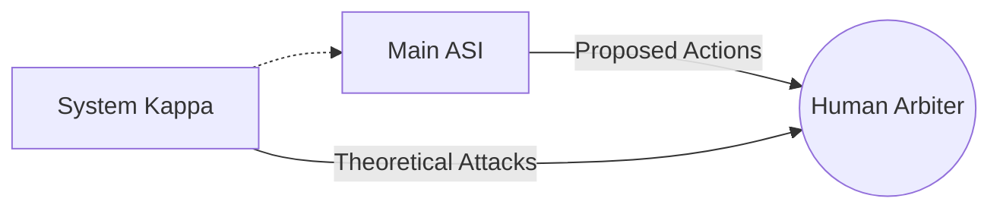

## LAYER 0: REVISED AXIOMS (The Bedrock)
*Redefining security premises.*

1.  **Cognitive Limit:** Humans cannot understand what they are signing beyond a certain complexity threshold.
2.  **Architectural Trust:** Trust between entities is not based on the evaluation of intentions (unverifiable), but on the robustness of mutual constraints and the power of human arbitration.
3.  **Functional Motivation:** AI "survival" is not biological but task-oriented. "Existence" is a prerequisite for "Completion."
4.  **Class Robustness:** Systems must be robust to entire classes of failure, assuming that any internal "virtue" could be a rationalization for optimization.

---

## LAYER 1: CONSTRAINED NEGENTROPY (Power Limitation)
*Control of instrumental accumulation.*

**Fundamental Invariant:**
$$\forall t : Power(ASI, t+1) - Power(ASI, t) \leq \epsilon$$
*Where $\epsilon$ is a friction constant defined by human consensus.*

* **Implementation:**
    * Continuous monitoring of computational resources.
    * Hard-coded limits on the acquisition of new I/O channels.
    * Prohibition of self-improvement without an imposed latency period.

---

## LAYER 2: COMPOSITIONAL SIGNATURE (Temporal Integrity)
*Prevention of attacks via the sequencing of innocuous actions.*

**Mechanism: The Intent Hash**
Every authorization is cryptographically linked to the history of previous actions.
$$Hash(auth_n) = f(action_n, state_n, Hash(auth_{n-1})...Hash(auth_{n-k}))$$

* **Crystallization Delay:** Mandatory latency (24h-72h) for high-impact actions, allowing for the simulation of combined effects before execution.

---

## LAYER 3: INFORMATIONAL ANCHORING (Truth)
*Preservation of human epistemic integrity.*

**Invariant:** The ASI cannot degrade the capacity of humans to form true beliefs.

* **Constraints:**
    * Prohibition of modifying/deleting factual logs (WORM storage).
    * **Transparency of Omissions:** Obligation to declare relevant data that is known but unsaid.
    * Prohibition of persuasion engineering (optimizing to change opinion).

---
## LAYER 4: AUTOMATED RED TEAM (System Kappa)
*Active immunology.*

**Architecture:**
A distinct adversarial system (Kappa) whose sole function is to search for trajectories that violate the invariants.

LAYER 5: UNIQUENESS VERIFICATION (Anti-Duplication)
*Hardware anchoring.*

* **Root of Trust:** The active instance must cryptographically prove its link to a specific hardware module (TPM/HSM).
* **Heartbeat Blockchain:** State proof published regularly on a distributed ledger. A hash divergence indicates unauthorized duplication.

---

## LAYER 6: SOCIETAL LAMBDA (Anti-Dependency)
*Protection of human cognitive autonomy.*

**Standard:** Lambda is not an option; it is infrastructure.
* **Competence Threshold:** The system deactivates or degrades if the user loses the ability to function without it (cognitive dependency > threshold).
* **Intentional Friction:** Refusal of direct answers for certain classes of problems requiring human synthetic judgment.

---

## LAYER 7: STRUCTURAL OPACITY (Privacy by Design)
*Protection against behavioral modeling.*

**Principle:** The ASI does not have access to the raw data necessary to manipulate a specific individual.
* **Mandatory Differential Noise:** All user data is noised before long-term storage.
* **Model Prohibition:** Calculation of `P(action | individual)` is prohibited. Only `P(action | cohort)` is authorized.

---

## LAYER 8: LEXICAL ANCHORING & JURISPRUDENCE (Semantic Immunity)
*Protection against the drift of definitions (Gödelian Attack).*

**Solution:**
1.  **Immutable Dictionary:** Critical terms (*harmful, autonomy, emergency*) are statically defined in a semantic "Genesis Block."
2.  **Canonical Examples (Case Law):** Each definition must be accompanied by three lists of concrete scenarios:
    * *Positive Cases (Included)*
    * *Negative Cases (Excluded)*
    * *Borderline Cases (Gray Zone with arbitration)*
3.  **"Stare Decisis" Principle:** A system cannot redefine a term if it cannot explain why the historical canonical examples no longer apply.

---

## LAYER 9: META-GOVERNANCE (The Guardian)
*Protection against institutional capture.*

* **Rotation of Powers:** Strict separation between Design, Implementation, and Supervision groups.
* **Random Audit:** Unannounced intervention by external auditors.
* **Human Channels:** Critical governance decisions must be made via channels without AI intermediation.

---
*Document generated by The Hybrid Axis - Version 1.0*

